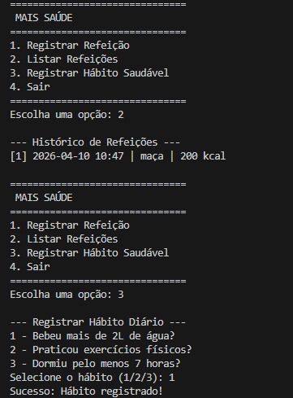
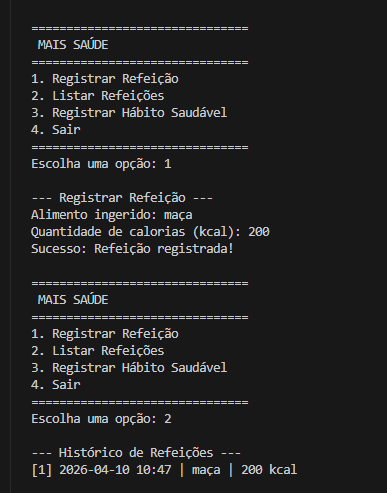

# Mais Saúde

Sistema de gerenciamento de dieta e hábitos saudáveis por linha de comando. Permite acompanhar refeições e verificar metas de hidratação, sono e atividades físicas.

## Informações
- Nome: Pedro Vitor Gomes Ferreira 
- RA: 22509172

## Como utilizar o sistema

O sistema foi desenhado para ser acessado pelo terminal. Antes de utilizar, garanta que possui o Python instalado (versão 3.8 ou superior).

1. Instale os requerimentos do projeto:
   pip install -r requirements.txt

2. Inicie o aplicativo:
   python -m src.main

3. Menu Principal:
   Ao abrir, voce vera o menu com 4 opcoes numericas:
   - "Registrar Refeicao": Digite 1 para inserir a data, qual alimento foi consumido e sua quantidade de calorias aproximada.
   - "Listar Refeicoes": Digite 2 para visualizar na tela o historico de tudo que voce ja comeu e suas respectivas calorias.
   - "Registrar Habito Saudavel": Digite 3 para selecionar e documentar se voce cumpriu suas metas de sono, exercicio ou agua no dia de hoje.
   - "Sair": Digite 4 para finalizar o uso da aplicacao.

As informacoes inseridas serao salvas automaticamente num arquivo local para que permaneçam salvas sempre que voce abrir aplicativo novamente.

Para verificar a integridade da aplicacao antes de usar, voce pode rodar as validacoes de codigo:

## Evidências de Funcionamento

Abaixo estão as capturas de tela do sistema em operação, demonstrando o registro de refeições e hábitos saudáveis:

